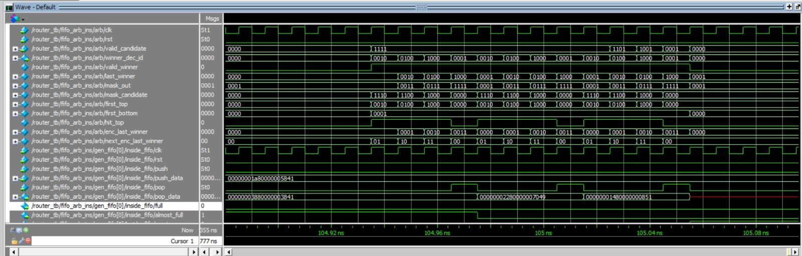

# Arbiter MAS
# 1. Overview
Brief Description:
This document details the micro-architecture of an Arbiter module designed to manage multiple client requests and select a winner based on a predefined arbitration scheme.

Purpose and Functionality:
The Arbiter module is used to arbitrate among NUM_CLIENTS clients. It determines which client gains access based on the input signals.

# 2. Block Diagram

# 3. Interfaces
Signal Descriptions:

| Signal Name      | Direction | Description                                 |
|------------------|-----------|---------------------------------------------|
| clk              | Input     | Clock signal.                               |
| rst              | Input     | Reset signal.                               |
| valid_candidate  | Input     | Array indicating valid candidates.          |
| winner_dec_id    | Output    | Decision array indicating the winner.       |

# 4. Functional Description
Operational Modes:

The module arbitrates among NUM_CLIENTS clients.
It uses the valid_candidate array to determine which clients are currently requesting access.
Data Flow Description:

The arbiter prioritizes clients based on a fixed scheme.
Upon determining a winner, the winner_dec_id signal is asserted corresponding to the winning client.

Waveform example:

In this waveform, we can observe the behavior of the arbiter through the changes in signal values. Initially, the 'valid_candidate' signal is set to 1111, indicating that all the candidates are valid and eligible for arbitration. As the arbitration process progresses, a winner is selected based on the round-robin algorithm, which ensures fair and cyclic access to resources.

Once the winner is determined, the 'mask_out' signal is updated to reflect the outcome of the arbitration. This signal is used to temporarily mask the winner in the next arbitration cycle, allowing other candidates an opportunity to access the resource. As a result, the 'valid_candidate' signal changes to 1101, showing that one of the candidates is now masked out.

The process continues in this manner, with the 'mask_out' and 'valid_candidate' signals being updated in each cycle to ensure that all candidates are granted access in a fair and orderly fashion, according to the round-robin scheme.

# 5. Configuration and Control
NUM_CLIENTS: Defines the number of clients participating in arbitration.

