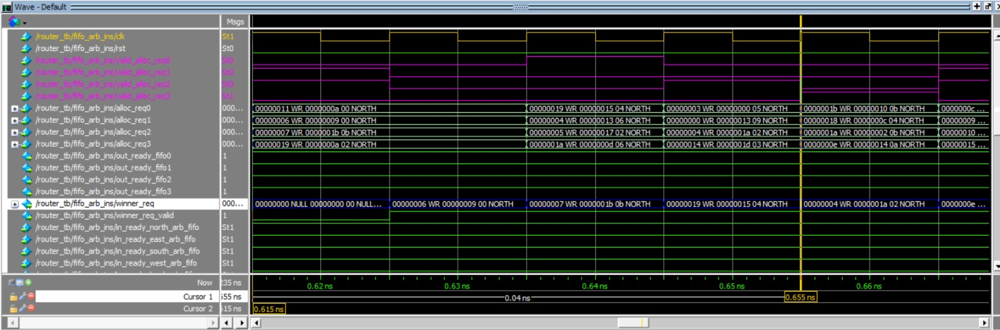
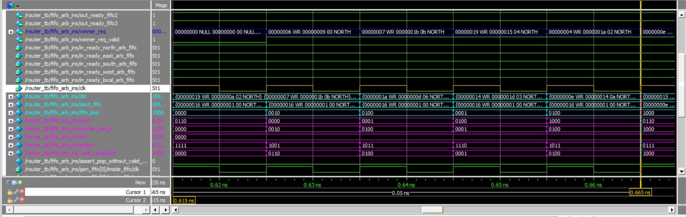
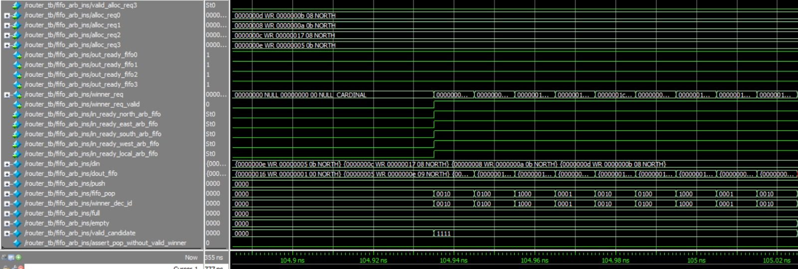

# FIFO_arb MAS
# 1. Overview
Brief Description:
This document outlines the micro-architecture of a fifo_arb module designed to manage multiple client requests and select a winner based on a predefined arbitration scheme. It interfaces with multiple fifos, arbitrates among them, and selects a winner to transmit data to the next tile.

Purpose and Functionality:
The fifo_arb module arbitrates among NUM_CLIENTS clients connected to different fifos. It uses an arbiter module to determine a winner based on the availability of data in the fifos and the readiness of the next tile to accept data.

# 2. Block Diagram

# 3. Interfaces
Signal Descriptions:

| Signal Name                   | Direction | Description                                                        |
|-------------------------------|-----------|--------------------------------------------------------------------|
| clk                           | Input     | Clock signal.                                                      |
| rst                           | Input     | Reset signal.                                                      |
| valid_alloc_req0, 1, 2, 3      | Input     | Signals indicating valid allocation requests from different clients (0 to NUM_CLIENTS-1). |
| alloc_req0, 1, 2, 3            | Input     | Transaction details of allocation requests from different clients (0 to NUM_CLIENTS-1). |
| out_ready_fifo0, 1, 2, 3       | Output    | Signals indicating whether the corresponding fifo (0 to NUM_CLIENTS-1) is ready to accept data. |
| winner_req                    | Output    | Transaction details of the winning request to be sent to the next tile. |
| winner_req_valid              | Output    | Signal indicating the validity of the winning request.              |
| in_ready_north_arb_fifo       | Input     | Signal indicating the readiness of the arbiter fifo in the North direction. |
| in_ready_east_arb_fifo        | Input     | Signal indicating the readiness of the arbiter fifo in the East direction.  |
| in_ready_south_arb_fifo       | Input     | Signal indicating the readiness of the arbiter fifo in the South direction. |
| in_ready_west_arb_fifo        | Input     | Signal indicating the readiness of the arbiter fifo in the West direction.  |
| in_ready_local_arb_fifo       | Input     | Signal indicating the readiness of the arbiter fifo in the Local direction. |

# 4. Functional Description
The fifo_arb module utilizes a complex Round Robin scheme to prioritize allocation requests from multiple clients. This scheme involves masking the Round Robin candidates with two conditions:

1. Valid Request Waiting to Pop: The Round Robin candidates are masked to exclude any clients whose allocation requests are not valid or ready to be processed. This ensures that only requests that are eligible for processing are considered in the Round Robin selection.

2. Target Readiness: Additionally, the Round Robin candidates are masked based on the readiness of the target FIFO arbiter to accept new requests. This means that even if a client has a valid request, it will only be considered if the target FIFO arbiter is ready to receive new requests. This condition optimizes the allocation process by ensuring that requests are processed efficiently and without unnecessary delays.

The combination of these masking conditions in the Round Robin scheme enhances the overall efficiency and fairness of request allocation in the fifo_arb module, allowing it to effectively manage multiple client requests and select winners based on predefined criteria.

Here is a wave example of the fifo_arb:

In this example, the first waveform provides a visual representation of the input data being fed into each FIFO. It then demonstrates how this data is subsequently outputted in a serial manner, maintaining the order in which it was inputted. The second waveform showcases the arbitration process in action. This process is responsible for selecting the correct FIFO for data output, taking into consideration a set of predefined rules. These rules include the round robin scheduling algorithm, the application of masks to filter out certain FIFOs, and the use of the find_first method to determine the priority of the FIFOs.

And here we can see the behavior in a back-pressure:

In this example, we're observing the 'valid_candidate' signal, which reflects the status of our FIFOs. Initially, we can see that all the FIFOs are intentionally filled to capacity, creating a deliberate blockage that prevents the acceptance of any new data. This is akin to purposely causing a traffic jam to test the system's response. When we decide to clear this intentional blockage, the FIFO arbiter, acting like a traffic controller, springs into action. It methodically starts to release the data from each of the FIFOs, gradually restoring the normal flow of data, much like easing a traffic jam to get cars moving smoothly again

# 5. Configuration and Control
Configuration Registers:

NUM_CLIENTS: Defines the number of clients participating in arbitration.  
FIFO_ARB_FIFO_DEPTH: Defines the depth of each fifo in the fifo_arb module.

# 6. Testing and Verification
In our tests, we aimed to achieve several objectives. One key goal was to ensure proper behavior during a back-pressure (BP) sequence. In a BP scenario, the system is intentionally put under stress by creating a bottleneck, causing data to accumulate upstream. The objective is to prevent data loss (no data drop) and maintain correct behavior under these conditions. Additionally, we aimed to ensure data integrity, making sure that the data remains uncorrupted and is accurately outputted in any use case.