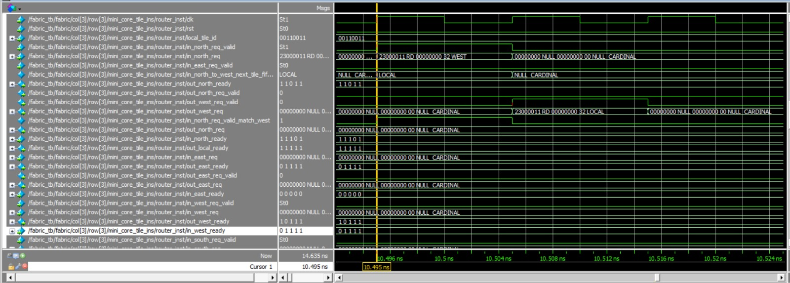

# Router MAS
# 1. Overview
Brief Description:
This document outlines the micro-architecture of the router module, which is designed to route and arbitrate requests between different directions (North, East, West, South, Local) in a tile-based system. It handles request validity, transaction details, and arbitration for data exchange.

Purpose and Functionality:
The router module is responsible for routing and arbitrating data requests between various directions based on input validity and arbitration logic. It ensures efficient communication between tiles within the system.

# 2. Block Diagram

# 3. Interfaces
Signal tables:

## Common Signals:
| Signal Name       | Direction | Description            |
|-------------------|-----------|------------------------|
| clk               | Input     | Clock signal.          |
| rst               | Input     | Reset signal.          |
| local_tile_id     | Input     | The ID of the current tile. |

## North Interface:
| Signal Name           | Direction | Description                                       |
|-----------------------|-----------|---------------------------------------------------|
| in_north_req_valid    | Input     | Signal indicating the validity of requests from the North direction. |
| in_north_req          | Input     | Transaction details for requests from the North direction. |
| in_north_ready        | Input     | Ready signal indicating the availability for data exchange from the North direction. |
| out_north_ready       | Output    | Ready signal indicating the availability for data exchange to the North direction. |
| out_north_req_valid   | Output    | Signal indicating the validity of requests forwarded to the North direction. |
| out_north_req         | Output    | Transaction details for requests forwarded to the North direction. |

## East Interface:
| Signal Name           | Direction | Description                                       |
|-----------------------|-----------|---------------------------------------------------|
| in_east_req_valid     | Input     | Signal indicating the validity of requests from the East direction. |
| in_east_req           | Input     | Transaction details for requests from the East direction. |
| in_east_ready         | Input     | Ready signal indicating the availability for data exchange from the East direction. |
| out_east_ready        | Output    | Ready signal indicating the availability for data exchange to the East direction. |
| out_east_req_valid    | Output    | Signal indicating the validity of requests forwarded to the East direction. |
| out_east_req          | Output    | Transaction details for requests forwarded to the East direction. |

## West Interface:
| Signal Name           | Direction | Description                                       |
|-----------------------|-----------|---------------------------------------------------|
| in_west_req_valid     | Input     | Signal indicating the validity of requests from the West direction. |
| in_west_req           | Input     | Transaction details for requests from the West direction. |
| in_west_ready         | Input     | Ready signal indicating the availability for data exchange from the West direction. |
| out_west_ready        | Output    | Ready signal indicating the availability for data exchange to the West direction. |
| out_west_req_valid    | Output    | Signal indicating the validity of requests forwarded to the West direction. |
| out_west_req          | Output    | Transaction details for requests forwarded to the West direction. |

## South Interface:
| Signal Name           | Direction | Description                                       |
|-----------------------|-----------|---------------------------------------------------|
| in_south_req_valid    | Input     | Signal indicating the validity of requests from the South direction. |
| in_south_req          | Input     | Transaction details for requests from the South direction. |
| in_south_ready        | Input     | Ready signal indicating the availability for data exchange from the South direction. |
| out_south_ready       | Output    | Ready signal indicating the availability for data exchange to the South direction. |
| out_south_req_valid   | Output    | Signal indicating the validity of requests forwarded to the South direction. |
| out_south_req         | Output    | Transaction details for requests forwarded to the South direction. |

## Local Interface:
| Signal Name           | Direction | Description                                       |
|-----------------------|-----------|---------------------------------------------------|
| in_local_req_valid    | Input     | Signal indicating the validity of requests from the Local direction. |
| in_local_req          | Input     | Transaction details for requests from the Local direction. |
| in_local_ready        | Input     | Ready signal indicating the availability for data exchange from the Local direction. |
| out_local_ready       | Output    | Ready signal indicating the availability for data exchange to the Local direction. |
| out_local_req_valid   | Output    | Signal indicating the validity of requests forwarded to the Local direction. |
| out_local_req         | Output    | Transaction details for requests forwarded to the Local direction. |

# 4. Functional Description
Operational Modes:

The router module operates in various modes depending on the input validity signals and arbitration logic. It routes and forwards requests between different directions while ensuring data integrity.

Data Flow Description:

1. The module receives requests from various directions, each with its associated validity signal, transaction details, and ready signal.
2. It performs arbitration to determine the priority of requests from different directions.
3. The selected request is then forwarded to the appropriate output direction.
4. Ready signals are asserted to indicate the availability for data exchange in the selected direction.

- One of the main issues that we had was the HOL(head of line) problem, first lets explain the issue.

### Head-of-Line Blocking (HOL):

- HOL blocking happens when a packet at the head of a queue in a router or switch prevents other packets behind it from being forwarded, even if those subsequent packets are destined for different output ports.
- Essentially, the presence of a single stalled or delayed packet can cause congestion and block the transmission of all other packets in the same queue, leading to inefficient use of network resources.
- This situation arises because packet switching devices typically process packets in a first-in-first-out (FIFO) manner, where packets are forwarded in the order they arrive. If a packet at the front of the queue encounters a delay (e.g., due to processing or waiting for an available output port), all subsequent packets in the same queue are also delayed, regardless of their priority or urgency.

### Impact of HOL:

- HOL blocking can significantly degrade network performance by increasing packet latency, reducing throughput, and causing jitter.
- In worst-case scenarios, HOL blocking can lead to packet loss and network congestion, especially in high-traffic environments.
- It becomes more pronounced in networks with bursty traffic patterns or when there are disparities in the arrival rates of packets destined for different output ports.

In our design, HOL blocking can occur if we naively insert only one fifo_arb for each router (to save space), with the output connected to other tiles. In this setup, if there is a transaction destined for the north, and behind it, there is a transaction bound for the south, the south transaction gets blocked by the north transaction. In other words, if the north tile is not ready, all other transactions will be stuck behind it.

The router module that addresses the HOL blocking problem by efficiently managing the allocation of communication resources among multiple incoming requests. Here's how the router module achieves this:

1. **Input Buffering**:
   - Incoming communication requests from neighboring tiles are first buffered in FIFO buffers within the `fifo_arb` module. Each FIFO buffer corresponds to a particular communication channel or direction, more info on the [mas_fifo_arb tab](mas_fifo_arb.md)

2. **Arbitration**:
   - The `fifo_arb` module uses the `arbiter` module to arbitrate among the buffered requests. The `arbiter` ensures fair access to the communication resources by selecting one request at a time based on a round-robin scheduling policy.
   - The arbitration process ensures that no single communication request monopolizes the communication resources, preventing HOL blocking by allowing all requests to be serviced in a fair and timely manner.

3. **Dynamic Selection**:
   - The `arbiter` module dynamically selects the next valid request from the buffered requests, considering factors such as whether the FIFO buffer has data and whether the corresponding arbiter is ready to accept data.
   - This dynamic selection ensures that if one FIFO buffer becomes empty or is not ready to accept data, the arbiter can quickly select another valid request from the remaining buffered requests.

4. **Optimized Routing**:
   - Once a request is selected by the `arbiter`, the `fifo_arb` module routes the corresponding data packet to the appropriate output port or neighboring tile.
   - By efficiently managing the routing of data packets based on the selected requests, the router module optimizes the usage of communication resources and minimizes the chances of HOL blocking.

5. **Continuous Operation**:
   - The router module operates continuously, buffering incoming requests, arbitrating among them, and routing data packets based on the arbitration results.
   - This continuous operation ensures that communication resources are utilized effectively and that incoming requests are processed without delays or bottlenecks caused by HOL blocking.

In summary, the router module utilizing the `fifo_arb` module, which incorporates the `arbiter` module, solves the HOL blocking problem by efficiently managing communication resources, ensuring fair access to these resources, and dynamically selecting and routing data packets based on incoming requests.

Waveform example:

In this waveform, we can observe the routing process in action. The router receives a request from the north, as indicated by the 'in_north_req' signal. After evaluating the request and determining the appropriate routing path, the router decides to forward this request westward. This decision is reflected in the 'out_west_req' signal, which becomes active, signifying that the request is being sent in the west direction. Additionally, we can see that the 'valid' and 'ready' signals are asserted correctly, ensuring a smooth and efficient data exchange between the different interfaces of the router. This example demonstrates the router's ability to dynamically route requests based on their destination, while managing the flow control signals to maintain data integrity and prevent congestion.

# 5. Tests and verification
Since one of the main issues was the occurrence of HOL, we needed to test it directly to provoke HOL and then verify its resolution. Therefore, we devised a Back Pressure (BP) test. This test fills all the FIFOs in the router and prevents any transactions from being released. At a certain point, after all the FIFOs are full, we release the blocking and allow the data to flow. Subsequently, we expect to observe that all the transactions that managed to enter the FIFOs are processed. Additionally, we aim to ensure that the router does not accept any new transactions while it is full, thus preventing any transactions from disappearing.

